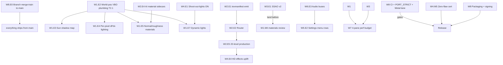

# MGB64 — AAA Remaster Program: Master Plan

**The program-level plan for taking MGB64 from "excellent remaster" to true AAA** — modern
lighting, HD assets everywhere, reference post-processing, immaculate feel, remastered audio,
couch + online multiplayer, and a shippable product — while the game underneath stays
**bit-for-bit the 1997 original** at every setting.

> **Authority chain:** [`docs/REMASTER_ROADMAP.md`](../REMASTER_ROADMAP.md) is the constitution
> (rails §1 are non-negotiable). This plan set is its production expansion: eight workstream
> documents (01–08, this directory), each deep enough that a junior team can sprint on it
> without asking questions. Every workstream doc was authored against the live
> `feat/metal-backend` tree (2026-07-02) and **independently fact-checked**: an adversarial
> verifier re-read the code behind every doc, checked 12–46 `file:line` anchors per doc, and
> fixed every error in place before this plan was assembled.

---

## 0. Vision — what "AAA" means here, concretely

A reviewer should boot `./build/ge007 --remaster` and see a game that reads as a
**professionally remastered classic** — the standard set by Halo: CE Anniversary / Quake II RTX-lite
class remasters, honest about the engine's forward-combiner ceiling:

| Dimension | The AAA bar (observable) |
|---|---|
| **Lighting** | Smooth-shaded world (no 1997 facet seams), real sun shadow maps (no blob shadows), per-pixel directional shading, normal/roughness materials on hero surfaces, muzzle-flash/lamp dynamic lights, hemisphere SSAO |
| **Assets** | HD textures on all 20 solo levels + weapons + characters + HUD, routed per-surface to the best source (AI upscale / procedural / open-licensed / original) with zero copyright exposure |
| **Presentation** | SMAA-class AA, HDR/EDR output on capable displays, HiDPI, dynamic resolution, locked 60 (target 120) on Apple Silicon via native Metal |
| **Feel** | ADS, gyro aim, full rebinding, in-game settings menu for every remaster toggle, accessibility (captions, colorblind palettes, flash/shake reduction), quick-restart + speedrun timer |
| **Audio** | Reference-fitted synth fidelity (no more "crappy MIDI"), working volume buses, room reverb + 48 kHz output chain, user music/SFX pack loaders |
| **Multiplayer** | Hardened 3–4-player split-screen at 60 fps, deterministic-lockstep netplay pathway (LAN → internet beta) |
| **Product** | Signed/notarized macOS app, CI-gated releases, zero known visual flaws, `--faithful` still byte-identical |

**And the three rails hold at every step** (roadmap §1): the sim never reads render state
(R1), no ROM-derived asset is ever committed (R2), and everything is opt-in with
default-identity (R3).

---

## 1. Where we start — the M0 baseline (proven, on `feat/metal-backend`)

Everything below is shipped and validated as of 2026-07-02:

- **Native Metal backend, complete (Phases 1–5)** — full game at GL parity (18 levels
  2.4–4.0% pixel-diff, split-screen 0.0%), the entire output-FX chain, and **SSAO running
  natively** — the op that hangs Apple's GL-over-Metal translator. Hardened by a 24-finding
  adversarial review; ASan-clean; RSS-flat over 600 frames; `gfx_metal.mm` strict-clean.
- **`--remaster`** boots the full experience in one switch (Metal + all FX + SSAO); 18/18
  levels, zero hangs. **`--faithful`** remains the byte-identical anchor.
- **Perf**: 101–189 fps across all 20 levels (GL, `docs/PERFORMANCE_PLAN.md`); Metal at parity.
- **P0 rails enforced in CI**: sim/render nm-separation, timing lock, sim-invariance hash gate.
- **HD texture loader + Real-ESRGAN/procedural tooling**, production-proven on Dam.
- **Gameplay**: campaign playable start-to-finish; 2P split-screen; ADS behind a flag;
  modern-feel flag suite shipped.

---

## 2. Program structure — the eight workstreams

Each doc follows the same template (current state → AAA bar → excruciating technical design →
task breakdown with IDs/files/acceptance-commands/estimates → milestones → risks → validation).

| WS | Document | Headline | Estimate |
|---|---|---|---|
| **W1** | [01-lighting-and-materials.md](01-lighting-and-materials.md) | Smooth env normals → sun shadow map → world-pos plumbing → per-pixel shading → normal/roughness materials → character normals → bounded dynamic lights. Metal-first, dual-backend, byte-identical off. | **~90 jd (≈20 jw)** |
| **W2** | [02-hd-asset-pipeline.md](02-hd-asset-pipeline.md) | The asset factory: texmanifest emit → deterministic Router → CC0 ingestion + NOTICE machinery → synth preset library → AI material sidecars → 20-level production process + QA harness. | **~100–108 jd (≈20–22 jw)** |
| **W3** | [03-advanced-rendering.md](03-advanced-rendering.md) | The unblocked prize: hemisphere SSAO v2 (reconstruction math, Metal-native), SMAA (+ TAA spike verdict), HDR/EDR, HiDPI, SSAO-under-MSAA, dynamic resolution, 120 Hz verdict, GPU profiling substrate. | **~94 jd (≈19 jw)** |
| **W4** | [04-content-geometry-effects.md](04-content-geometry-effects.md) | Zero known visual flaws: shoot-out-the-lights verified + default-ON (already coded!), train sky leak resolved, glass shards signed off, HD effects + soft particles, flaw-ledger certification. | **~78 jd (≈16 jw)** |
| **W5** | [05-gameplay-feel-ux.md](05-gameplay-feel-ux.md) | ADS completion, in-game settings menu, gyro + rebinding, captions/colorblind/flash-reduction accessibility, quick-restart + speedrun timer, onboarding. | **~65 jd (≈13 jw)** |
| **W6** | [06-audio-remaster.md](06-audio-remaster.md) | Reference-fitted fidelity (H1/H2/H3), working volume buses, 48 kHz + room reverb output chain, music/SFX pack loaders (users supply Tier-B audio locally). | **~96 jd (≈19 jw)** |
| **W7** | [07-multiplayer.md](07-multiplayer.md) | 3–4P split-screen hardening + pane-correct HUD/post-FX + 4-pane 60 fps budget; then deterministic-lockstep netplay (the sim-hash work *is* the state inventory), staged loopback → LAN → rollback verdict → internet beta. | **~100 jd (≈20 jw)** |
| **W8** | [08-engineering-foundation.md](08-engineering-foundation.md) | The shipping machine: branch merge-train to `main`, Metal-default-on-macOS decision path, signed/notarized `.app`, macOS CI lane + PORT_STRICT cleanup, Metal perf census, crash diagnostics, release process. | **~66 jd (≈13 jw)** |

**Program total: ≈ 690 junior-days ≈ 138 junior-weeks.**
With a squad of **6 juniors + 2 seniors** (reviews, unblocking, the hard 20%):
**≈ 5–7 calendar months** accounting for dependencies and ramp. With 8 juniors: ≈ 4–5 months.

---

## 3. Cross-workstream dependency graph



**The four load-bearing edges** (schedule around these):
1. **W8.E0 (merge train) is first** — five in-flight branches must consolidate onto `main`
   before parallel squads fork from it.
2. **W1.E2 world-pos plumbing** gates all per-pixel work (shadows, materials, dynamic lights).
   It is the single highest-leverage engine task in the program.
3. **W2.E1→E2 (manifest + Router)** gates scaled asset production and the material sidecars
   that make W1.E5 worth shipping.
4. **W3.E1 SSAO v2 before W1.M4** — so AO isn't re-tuned twice under the new lighting.

---

## 4. Program milestones (PM0–PM5)

Each program milestone is a **demoable build** with entry/exit criteria. Workstream-level
milestones (each doc §6) roll up into these.

### PM0 — "Baseline locked" *(now)*
Everything in §1. Exit: this plan merged; squads assigned.

### PM1 — "Foundation" *(≈ weeks 1–3)*
- **W8**: merge train complete — `main` carries Metal backend + dam-HD + perf + robustness +
  split-screen; CI green incl. new macOS/Metal lane bring-up; PORT_STRICT fix plan started.
- **W2**: texmanifest C emit + Router v1 (deterministic plan JSON, Tier-B refusal).
- **W1**: **M1 smooth env normals** — the Dam rock-facet seams die (`GE007_ENV_SMOOTH_NORMALS` A/B).
- **W4**: **M1 lights-out** — shoot-out-the-lights verified + population-gap fixed + default ON.
- **Exit demo:** `--remaster` on Dam with smooth normals; shooting out a Bunker lamp darkens the room.

### PM2 — "The lit world" *(≈ weeks 4–8)*
- **W1**: M2 world-pos in both shader generators (GL==Metal parity gate) + per-pixel sun;
  **M3 sun shadow map** — blob shadow retired in remaster mode.
- **W3**: SSAO v2 (hemisphere + bilateral blur) + SMAA landed; TAA spike verdict recorded.
- **W2**: first 5 levels through the production pipeline (Dam, Facility, Surface, Bunker, Silo).
- **W6**: M1 measured fidelity baseline + H1/H2 landed; M2 working volume buses.
- **W5**: settings-menu MVP (remaster page reading the registered `Video.*` keys).
- **Exit demo:** Surface at dusk — cast shadows, hemisphere AO, SMAA edges, HD terrain, correct music timbre.

### PM3 — "Materials & sound" *(≈ weeks 9–14)*
- **W1**: **M4 materials** — `tok####_n/_r` sidecars light up on hero surfaces (W2.E4 feeds this).
- **W2**: all 20 levels routed + packed + QA'd; weapons/characters/HUD passes.
- **W6**: M3 remaster output chain (48 kHz, room reverb) + M4 music packs.
- **W4**: M3 glass signed off + M4 HD effects/soft particles.
- **W7**: split-screen hardening (3–4P, pane-correct HUD/post-FX, 4-pane budget met).
- **W3**: HDR/EDR + HiDPI shipped.
- **Exit demo:** any level, 4K HiDPI HDR, materials responding to the sun, reverberant audio, 4-player couch match.

### PM4 — "AAA candidate" *(≈ weeks 15–20)*
- **W1**: M5 character normals + dynamic lights; default-flip review for the whole lighting stack.
- **W5**: complete (ADS authored, gyro, rebinding, accessibility, QoL).
- **W6**: M5 SFX packs + Surface-2 instrument fixes.
- **W4**: **M5 zero-known-flaws certification** — the flaw ledger is empty.
- **W3**: 120 Hz / view-interpolation verdict executed (ship or formally defer).
- **W8**: packaging + signing + notarization; release checklist binds all gates.
- **W7**: netplay M1 loopback lockstep proof + M2 LAN 2P.
- **Exit demo:** the release-candidate `.app` — a reviewer plays any level cold and finds nothing dated and nothing broken.

### PM5 — "Ship" *(≈ weeks 21–26)*
- Stabilization + perf census regression budgets green on both backends.
- **W8**: Metal-default-on-macOS flip (per the decision path) + tagged release.
- **W7**: netplay rollback verdict + internet beta (stretch — explicitly cuttable).
- **Exit:** public release; `--faithful` byte-identity re-certified on the release binary.

---

## 5. Team allocation (6 juniors + 2 seniors)

| Squad | People | Owns | First task (day 1) |
|---|---|---|---|
| **Render** | 2 juniors + senior-A (50%) | W1, W3 | W1.E1.T1 normal-cache diag (doc §5); read doc §4.3 first |
| **Assets** | 1 junior | W2 | W2.E1.T1 texmanifest emit (doc §5) |
| **Content** | 1 junior | W4 + W5 QoL | W4.E1.T1 lights-out verification run |
| **Audio** | 1 junior | W6 | W6.E1.T1 N64 reference capture session |
| **Systems** | 1 junior + senior-B (50%) | W7, W8 | W8.E0.T1 merge-train step 1 (doc §5 order) |
| **Seniors** | remaining 50% ×2 | Reviews, W1.E2/W7 netplay hard parts, unblocking | Review cadence below |

**Cadence:** every task lands as its own PR against the workstream's acceptance commands;
senior review within 24 h; weekly program demo against the current PM exit criteria;
**every PR** runs the §6 validation doctrine. Estimates in the docs are junior-days
(seniors ≈ 2–3× faster — use them on W1.E2, W1.E3, and W7.E4 only).

---

## 6. Governance — the non-negotiables (every PR, every workstream)

1. **Rails** (roadmap §1): R1 sim-never-reads-render (CI nm-gate + RAMROM sim-hash for anything
   sim-adjacent), R2 copyright tiers (contamination guard; Tier-B assets never committed —
   AI-upscales of ROM content and tone-matched output are Tier B, always local), R3 opt-in
   default-identity (a named `GE007_*`/`Video.*`/`Input.*` flag per feature; all-off byte-identical).
2. **Dual-backend shader rule**: every generator change lands in **both** `gfx_opengl.c` (GLSL)
   and `gfx_metal.mm` (MSL) in the same PR, with the GL↔Metal parity capture in the PR body.
3. **Validation doctrine** (roadmap §7): deterministic screenshot A/B with per-golden
   `--max-changed-pct` budgets; `tools/compare_state.py` cross-run; `tools/sim_invariance_gate.sh`
   for flags; ASan on touched paths; zero warnings; contamination guard green.
4. **Honest ceilings**: roadmap §8's out-of-scope list stands (no full deferred PBR, no SSR,
   no mesh re-topology). Any proposal to breach it needs a written spike + program-lead sign-off.

## 7. Top program risks (cross-cutting; per-WS risks live in each doc §7)

| # | Risk | Mitigation / kill criterion |
|---|---|---|
| 1 | **W1.E2 plumbing destabilizes the byte-identical rail** (it touches the hottest path in `gfx_pc.c`) | Attributes exist only behind new SHADER_OPT bits; identity-off `cmp` gate per commit; senior-owned; kill = any identity regression that survives 2 fix attempts → redesign behind a build flag |
| 2 | **Shadow-map capture-and-replay 1-frame latency reads as lag** on moving characters | W1 doc §7 fallbacks (fit hysteresis, character-only shadows, 2nd cascade); kill = M3 review fails on Bunker guards → ship env-only shadows |
| 3 | **Asset curation doesn't scale to 20 levels** | Router auto-routes the long tail; top-5 hero tokens per level hand-curated, 2-junior-day cap per level (W2 doc §7) |
| 4 | **Netplay rollback infeasible** (state save/restore cost) | Staged: lockstep-with-input-delay ships value first; rollback is a gated verdict at W7.M3, not a promise |
| 5 | **Schedule interlock** (W1.E2 late → three workstreams idle) | W1.E5 can start with hand-listed tokens; W3/W2/W6 have zero dependency on E2; re-sequence at weekly demo |
| 6 | **GL-over-Metal flakiness poisons macOS CI** | CI's macOS lane runs Metal (deterministic, proven); GL correctness lanes run on Linux |

## 8. How to start (literally)

```bash
# 1. Read the constitution, then your workstream doc end-to-end:
open docs/REMASTER_ROADMAP.md docs/remaster-aaa/0<N>-*.md
# 2. Verify your environment reproduces the baseline:
cmake -S . -B build && cmake --build build --parallel 8
./build/ge007 baserom.u.z64 --remaster --level dam        # the current full remaster
./build/ge007 baserom.u.z64 --faithful --level dam        # the byte-identical anchor
# 3. Take your squad's day-1 task from §5 and its acceptance command from your doc §5.
# 4. Every PR: run your doc's §8 validation block before requesting review.
```

---

*Assembled 2026-07-02 from eight adversarially-verified workstream documents (16 agents,
~850 code reads). Anchors are function-level and drift; each workstream doc states its
verification date. This document is the program index — the workstream docs are the truth
for their own scope.*
